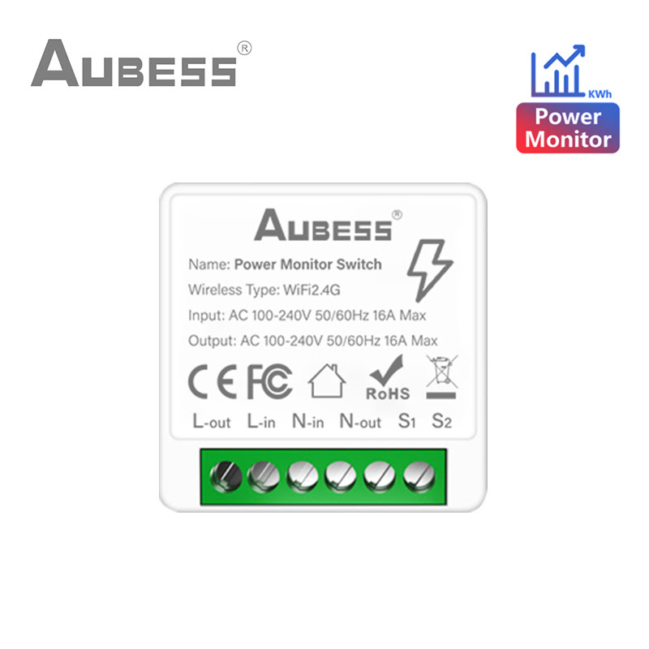
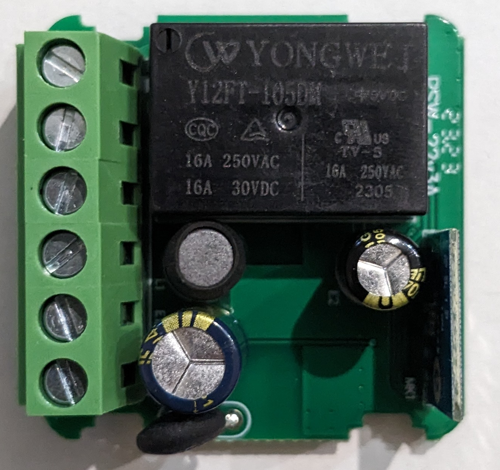
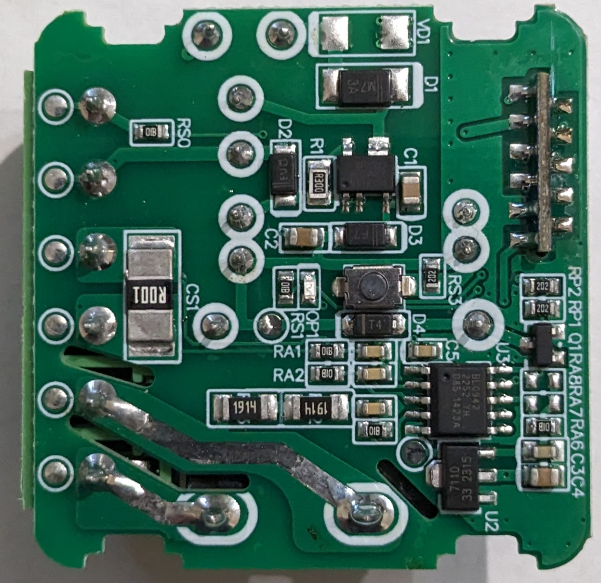
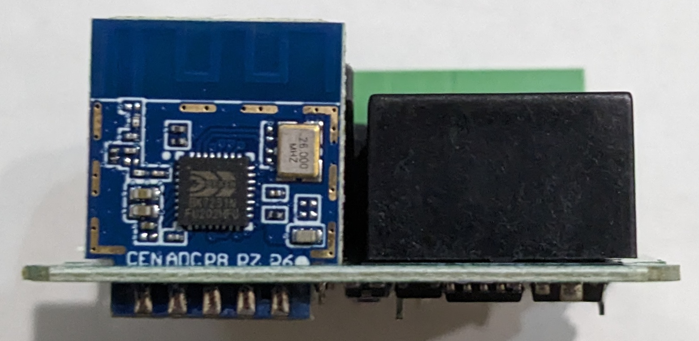

# "AUBESS Tuya WiFi Mini Smart Switch with Energy Monitor 16A 2-way control"

Markings:
> Name: Power Monitor Switch  
> Wireless Type: WiFi2.4G  
> Input: AC 100-240V 60/60Hz 16A Max  
> Output: AC 100-240V 50/60Hz 16A Max  

## Images

|  | 
|-|
| Product Image |

|  |  | 
|-|-|-|
| PCB Top Side | PCB Bottom Side | WiFi Module |

## Electrical Details

This device uses the [Tuya CB2S](https://docs.libretiny.eu/boards/cb2s/) wifi module based on the BK7231N MCU.
Switching of mains is done using a relay rated at 250VAC 16A. 
For Power Monitoring, it utilizes the [Belling BL0942](https://esphome.io/components/sensor/bl0942.html).

External inputs are provided by a onboard push button as well as a connection terminal labeled S1 and S2, which may be used to connect an external switch.

Power to the module is supplied using a non-insulated power supply, possibly a capacitive dropper.
Since the leads to S1 and S2 are connected without much protection, they may be unsafe to touch.

### L-out, L-in, N-in, N-out

L-out and L-in are connected to the relay, and are what is actually switched.

N-in and N-out are connected through with a 0.001 Ohm resistor, which is required for current measurement using the BL0942.

> [!TIP]
> Connecting only N-in will work, but the power monitor will not function.

### BL0942

The BL0942 power monitoring ic is directly connected to the CB2S module's TX1 and RX1 pins.

### PCB Push-Button

The onboard push button is connected to P23 of the CB2S module, connecting to ground when pressed.

### External Switch /  S1 and S2 Terminals

The S1 and S2 terminals may be used to connect and external switch to the device.
S1 is connected directly to the GND connection of the device.
S2 is connected to P24 of the CB2S module, with a inline protection resistor.

> [!CAUTION]
> S1 and S2 may be insufficiently insulated from mains. 
> Excercise caution when connecting an external switch.

### PCB LED

The onboard led is connected to P8 of the CB2S module through a current-limiting resistor.
The led is turned on when P8 is set to LOW level.

### Relay

The relay is controlled by a NPN transistor, whose base is connected to P26 of teh CB2S module.
Thus, the relay is powered when P26 is set to HIGH level.

## ESPHome configuration

A template ESPHome configuration is provided in [`aubess.yaml`](./aubess.yaml).

It exposes:
- relay switch
- measurements of the BL0942 (voltage, current, power, energy, grid frequency)
- wifi signal strength (dbM and %)

