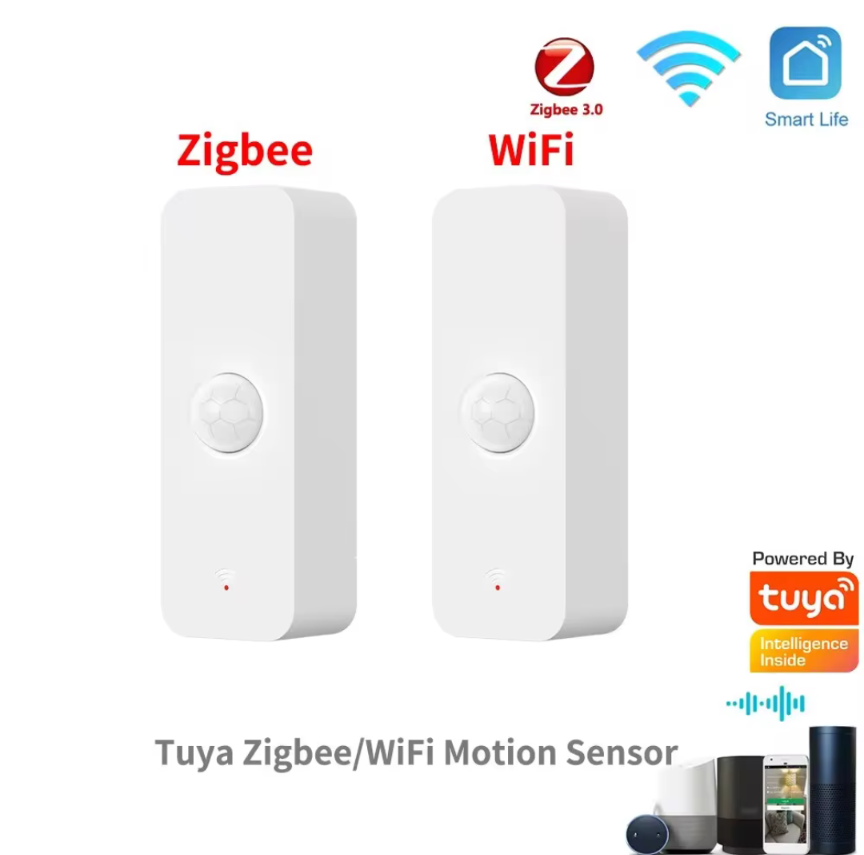

# "Tuya WiFi PIR Motion Sensor" (P01)

Markings:
> Model: P01
> Wireless Type: WiFi 2.4G

## Images

|  | 
|-|
| Product Image |

|  |  |
|-|-|
| PCB Front Side | PCB Back Side |

## Schematic

|  |  |
|-|-|
| PCB Front Side + Annotations | PCB Back Side + Annotations |

|  | 
|-|
| Reverse-Engineerded Schematic |

## Electrical Details

this device uses a [CB3S](https://docs.libretiny.eu/boards/cb3s/) wifi module based on the BK7231N MCU.
the wifi module only handles communications, all other functions are handled by a (unmarked) TuyaMCU.
PIR motion detection is handled by a [BS612](https://cdn-shop.adafruit.com/product-files/5578/C17724.pdf).

### Battery Usage

battery usage seems to be quite good, with the device consuming about 50 uA while not detecting motion. 
when the wifi module is powered up, the current rises to about 80 mA.

## Mode of Operation

the TuyaMCU is at the hearth of this device.

when motion is detected, or the switch is pressed (used for wifi reset with tuya firmware), the tuyamcu will switch on power to the wifi module for about 30 seconds.
the wifi module has to use this time to publish a "motion detected" message to the server. 
after those 30 seconds, power is cut for another 30 seconds, after which the wifi module is again powered up for 30 seconds.
this second power-up is used to publish a "motion clear" message to the server.

after this, the module seems to enter a dormant state for about 60 seconds, during which motion does not cause the wifi module to power up.

by repeatedly pinging the TuyaMCU, the power-on time may be extended.
the exact mechanism behind this isn't quite sure tho, since the communication protocol used doesn't quite match the [public tuyamcu serial protocol](https://developer.tuya.com/en/docs/iot/tuya-cloud-universal-serial-port-access-protocol?id=K9hhi0xxtn9cb).

## ESPHome configuration

A template ESPHome configuration is provided in [`motion-sensor.yaml`](./motion-sensor.yaml).

it requires a mqtt broker, since the esphome api is too slow for a battery powered device.

