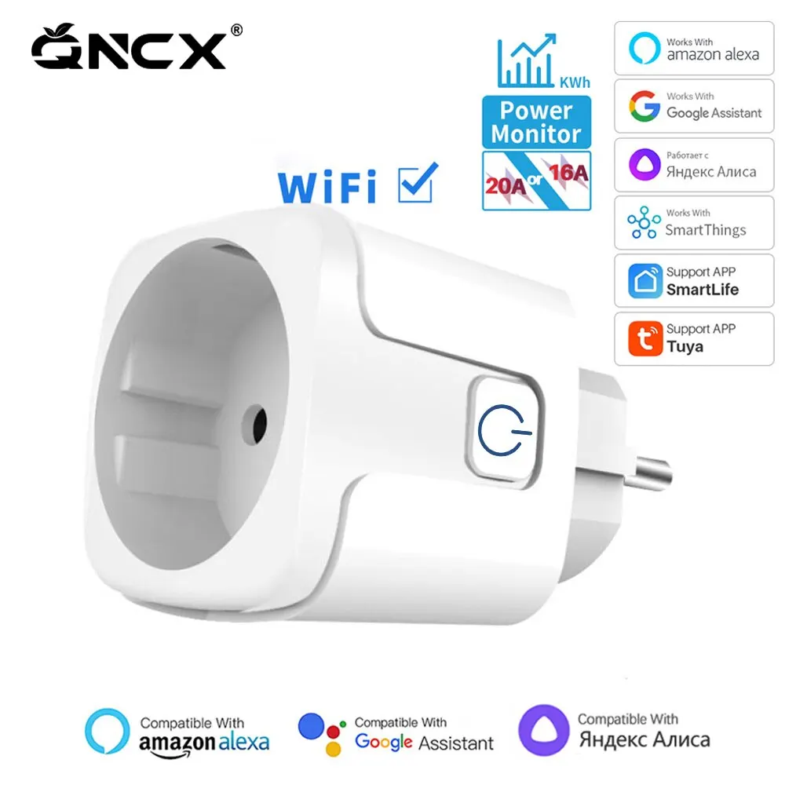
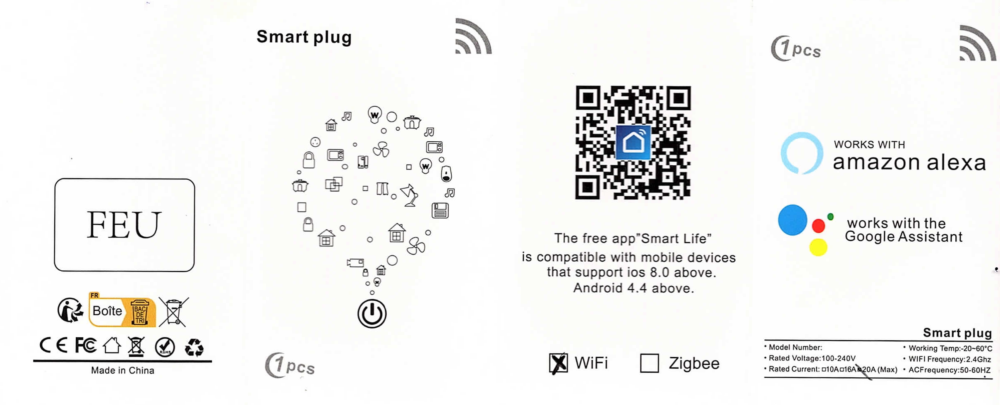
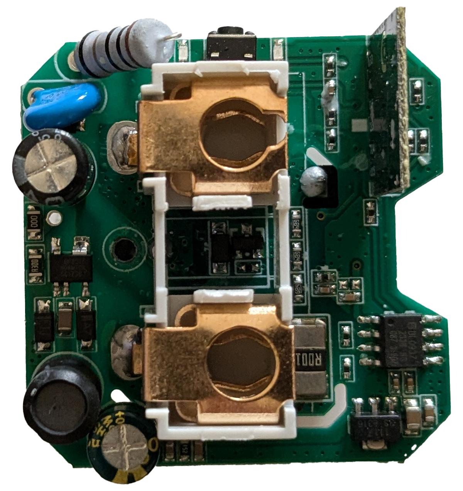
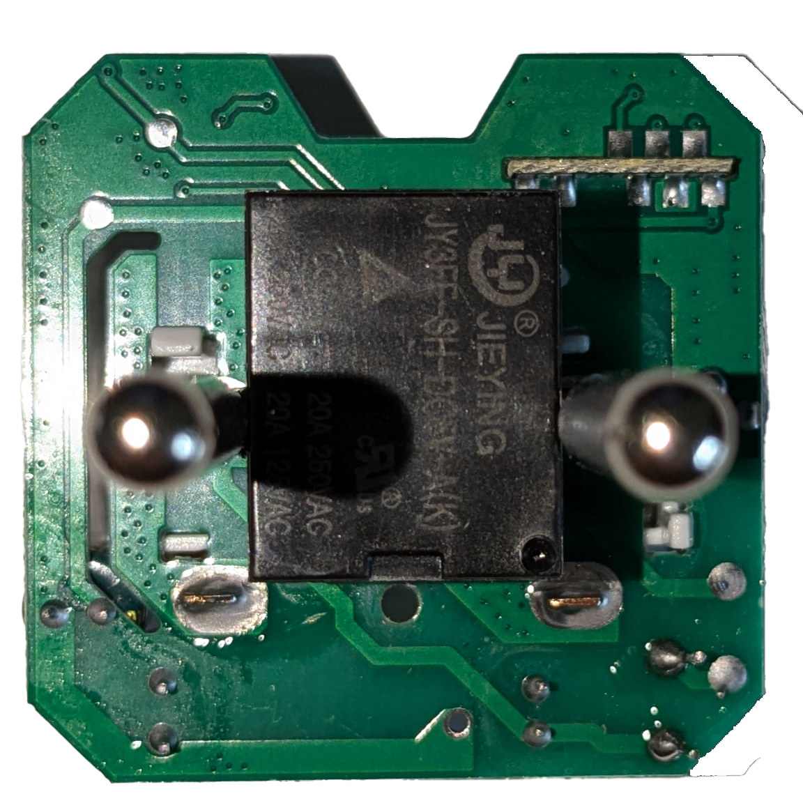
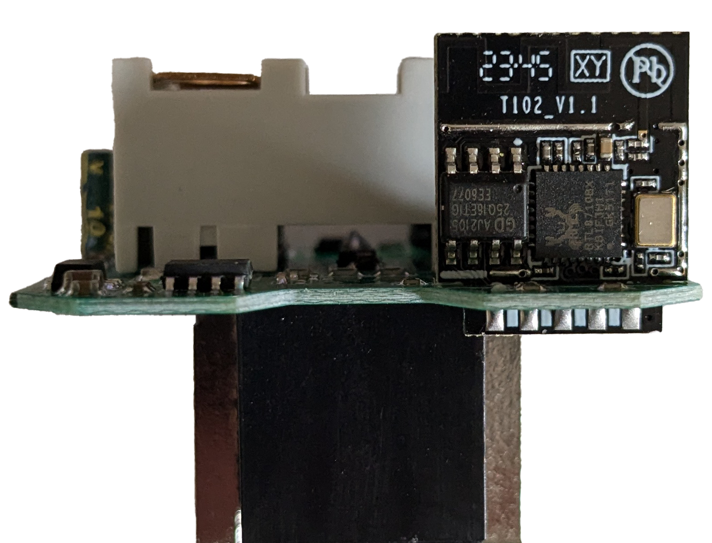
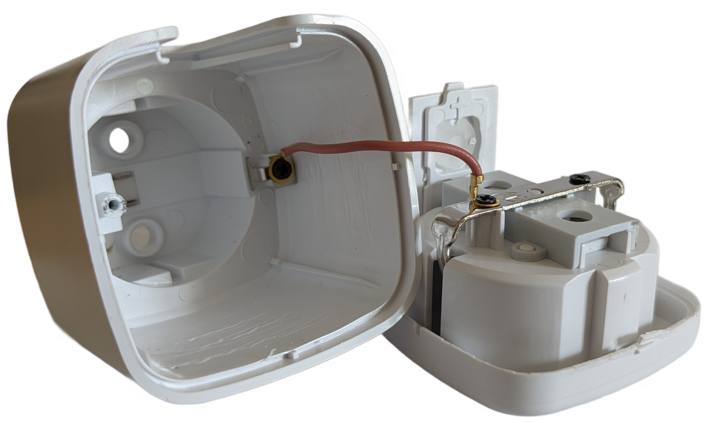
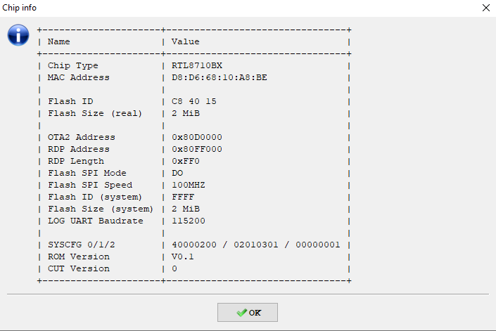

# "Tuya 20A EU Smart Socket WiFi Smart Plug with Power Monitor"

Markings:
> Model Number: <EMPTY>\*   
> Rated Voltage: 100-240V   
> Rated Current: 20A (Max)   
> Working Temp: -20~60°C   
> WIFI Frequency: 2.4Ghz   
> AC Frequency: 50-60Hz

> \* i assume that some other models may actually have a model number printed here, but mine did not...   
> talk about white-label

## Images

|  | 
|-|
| Product Image |

|  | 
|-|
| Product Package |

|  |  | 
|-|-|-|
| PCB Top Side | PCB Bottom Side | WiFi Module |

|  |  |
|-|-|
| Case | LTChipTool Chip Info |

## Electrical Details

This devices uses a variant of the [T102-v1.1](https://docs.libretiny.eu/boards/t102-v1.1/) wifi module based on the RTL8710BX MCU.
Switching of mains is done using a relay rated at 250VAC 20A.
For power monitoring, it utilizes the [BL0937](https://esphome.io/components/sensor/hlw8012.html).

Power to the module is supplied using a [BP2525](https://www.bpsemi.com/upload/en/file/2023-03/col583/1680075153809.pdf) non-insulated switch mode power supply.

> [!CAUTION]
> The power supply is _non-insulated_, meaning that the onboard circuits may be at mains level!
> NEVER plug the device into a socket with the case removed.

> [!TIP]
> If you wish to safely power up the device without the case, connecting > 12VDC to the power input will work.
> Note that in this configuration, the power monitor will not report correct values.

### BL0937

The BL0937 power monitoring ic is connected to the wifi module through resistors:

| BL0937 Pin | WiFi Module Pin|
|-|-|
| SEL | P14 |
| CF  | P0  |
| CF1 | P12 |

### PCB Push-Button

The onboard push-button is directly connected to P18 of the wifi module, connecting to ground when pressed.

### PCB LEDs

the PCB contains two LEDs, one left and one right of the push-button. 
They'll be referred to as LED1 and LED2 respectively.

LED1's cathode is connected to P5 through a resistor of unknown value. 
The anode is connected to P18 trough another resistor of unknown value.
Assuming P18 is pulled high (through a pull-up, as required for the push-button), the LED1 will light up when P5 is LOW level.

LED2 is connected to P15 and lights up when the pin is HIGH level.
Since the relay and LED2 share the same pin, LED2 will always light up when the relay is closed.

### Relay

The relay is (presumably) controlled by a NPN transistor, whose base is connected to P15 of the wifi module.
Thus, the relay is closed when P15 is set to HIGH level.

## ESPHome configuration

A template ESPHome configuration is provided in [`wl-tuya.yaml`](./wl-tuya.yaml).

It exposes:
- relay switch
- measurements of the BL0937 (voltage, current, power, energy)
- wifi signal strenght (dbM and %)

> [!IMPORTANT]
> You may need to run [the calibration](https://esphome.io/components/sensor/hlw8012.html#calibration) for the BL0937 to get correct measurements.

